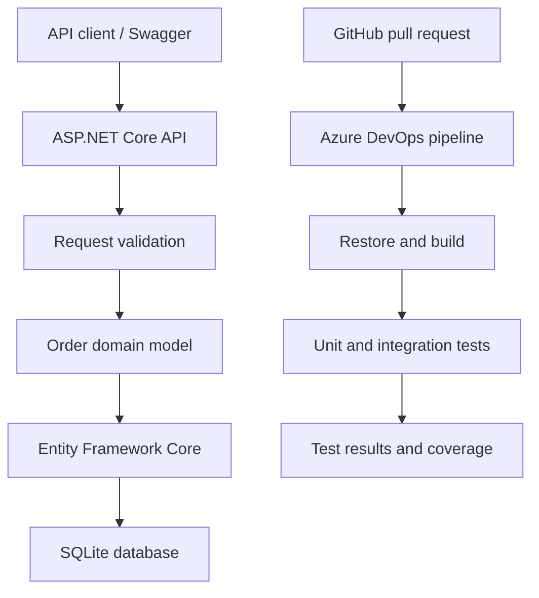

# QualityGateLab — Continuous Testing

QualityGateLab is an in-progress continuous quality engineering project combining .NET test automation with AZ-400 DevOps practices.

The project currently demonstrates .NET 10, xUnit, API integration testing, EF Core, SQLite, GitHub pull requests, Azure Boards traceability and Azure DevOps continuous integration.

## Current implementation

* ASP.NET Core customer-order REST API
* Test-first order domain model
* Required-field and email validation
* Quantity boundary validation from 1 to 100
* Unique order identifiers
* Initial `Pending` order status
* EF Core persistence using SQLite
* EF Core database migrations
* Swagger/OpenAPI documentation
* xUnit unit and integration tests
* GitHub feature-branch and pull-request workflow
* Azure Boards work-item traceability using `AB#` references
* Azure DevOps YAML continuous integration pipeline
* Automated test-result and code-coverage publishing

## Architecture



## API endpoints

| Method | Endpoint           | Purpose                 | Successful response |
| ------ | ------------------ | ----------------------- | ------------------- |
| `POST` | `/api/orders`      | Create a customer order | `201 Created`       |
| `GET`  | `/api/orders/{id}` | Retrieve an order by ID | `200 OK`            |

Example create-order request:

```json
{
  "customerEmail": "customer@example.com",
  "productName": "Mechanical Keyboard",
  "quantity": 2
}
```

Example response:

```json
{
  "id": "generated-order-guid",
  "customerEmail": "customer@example.com",
  "productName": "Mechanical Keyboard",
  "quantity": 2,
  "status": "Pending",
  "createdAtUtc": "2026-08-20T18:00:00Z"
}
```

## Run locally

Requirements:

* .NET 10 SDK
* Git

Clone and restore the repository:

```powershell
git clone https://github.com/kemalyasintha/qualitygatelab-continuous-testing.git
Set-Location qualitygatelab-continuous-testing
dotnet restore
```

Create or update the local SQLite database:

```powershell
dotnet tool restore

dotnet ef database update `
  --project src\QualityGateLab.Api `
  --startup-project src\QualityGateLab.Api
```

Start the API:

```powershell
dotnet run --project src\QualityGateLab.Api
```

Use the URL displayed in the terminal and append `/swagger` to open the interactive API documentation. For example:

```text
http://localhost:5034/swagger
```

The local port may be different on another computer.

## Run the automated tests

Run the complete test suite:

```powershell
dotnet test
```

Run the unit tests:

```powershell
dotnet test tests\QualityGateLab.UnitTests
```

Run the integration tests:

```powershell
dotnet test tests\QualityGateLab.IntegrationTests
```

Run all tests with code coverage:

```powershell
dotnet test --collect:"XPlat Code Coverage"
```

The test suite covers:

* Required order fields
* Email validation
* Quantity boundaries
* Unique identifiers
* Initial order status
* SQLite persistence
* Successful API order creation
* Invalid API requests
* Retrieving a created order

## Continuous integration

The Azure DevOps YAML pipeline runs for changes to `main`, feature branches and pull requests.

Current CI stages include:

1. Install the .NET 10 SDK
2. Restore NuGet packages
3. Build the solution in Release configuration
4. Restore the repository’s local .NET tools
5. Validate EF Core migrations against a temporary SQLite database
6. Run unit and integration tests
7. Collect code coverage
8. Publish test results and coverage to Azure DevOps
9. Report the pipeline result as a GitHub pull-request check

The first customer-order pull request passed the Azure Pipeline quality check before being merged into `main`.

## Work-item traceability

Development work is planned in Azure Boards using the Agile process:

```text
Epic → Feature → User Story → Task
```

Git commits include Azure Boards references such as `AB#3`, connecting code changes to the corresponding work item.

## Project roadmap

* [x] Create order domain model
* [x] Add unit and integration tests
* [x] Add request validation
* [x] Configure EF Core and SQLite
* [x] Add database migration testing
* [x] Implement create-order and get-order endpoints
* [x] Add Swagger/OpenAPI
* [x] Add Azure DevOps continuous integration
* [ ] Configure GitHub branch protection and required quality checks
* [ ] Add Playwright end-to-end tests
* [ ] Define Azure infrastructure using Bicep
* [ ] Deploy the API through Azure DevOps
* [ ] Add Application Insights monitoring
* [ ] Add post-deployment smoke tests
* [ ] Add deployment environments and approval gates

## Project evidence

* [Merged customer-order pull request](https://github.com/kemalyasintha/qualitygatelab-continuous-testing/pull/1)
* Azure Pipeline validation displayed as a successful GitHub pull-request check
* Automated test results and code coverage published in Azure DevOps

Additional pipeline, test and deployment screenshots will be added as the project progresses.

## Technologies

* .NET 10
* ASP.NET Core
* C#
* xUnit
* Entity Framework Core
* SQLite
* Swagger/OpenAPI
* Git and GitHub
* Azure Boards
* Azure DevOps Pipelines
* YAML

## Status

This is an actively developed portfolio project. Playwright testing, Bicep infrastructure, Azure deployment and Application Insights monitoring are planned for upcoming milestones.
